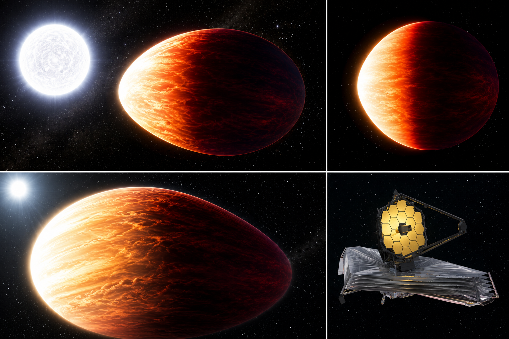

# WASP-121 b — Exoplanet Atmosphere Report
<!-- RESEARCH-IDENTITY-START -->
**Independent research report by [Biswajit Jana](https://biswajit1999.github.io/Biswajit_Jana.github.io/)** · [Live report](https://biswajit1999.github.io/wasp-121b-exoplanet-report/) · [ORCID](https://orcid.org/0009-0002-2411-1891) · [Complete research portfolio](https://biswajit1999.github.io/Biswajit_Jana.github.io/research/exoplanets/)
<!-- RESEARCH-IDENTITY-END -->


<p align="center">
  
</p>

<p align="center"><em>AI-generated artist's concept — not a real photograph. See the report for actual JWST NIRSpec/G395H data.</em></p>

An ultra-hot Jupiter on a 1.27-day orbit, tidally distorted by its host
star, with a measured day-night temperature contrast of roughly 1490 K.
This repo extracts that contrast from a JWST phase-resolved emission
spectroscopy dataset, propagating each point's own posterior
uncertainty rather than reporting a bare difference of averages.

**[Open the full report](https://biswajit1999.github.io/wasp-121b-exoplanet-report/)** — the live GitHub Pages version. You can also open `index.html` locally in a browser, or serve it with `python -m http.server` from this directory.

## Data sources

- **System parameters** — from the NASA Exoplanet Archive TAP
  service (`pscomppars` table).
- **Phase-resolved emission spectrum** — reduced JWST NIRSpec/G395H
  data: brightness temperature (with asymmetric posterior uncertainty)
  as a function of both wavelength (349 channels, 2.7-5.2 microns) and
  orbital phase (36 bins spanning almost a full orbit), from
  Evans-Soma, Sing et al. (2025), released publicly on Zenodo
  ([10.5281/zenodo.20651891](https://doi.org/10.5281/zenodo.20651891)).
- **Analysis** — `scripts/analyze_spectrum.py` combines the brightness-
  temperature spectrum over phase bins nearest secondary eclipse
  (dayside-facing) and nearest primary transit (nightside-facing) with
  an inverse-variance weighted mean, using each point's own symmetrized
  posterior uncertainty, and propagates that into an error bar on the
  day-night contrast at every wavelength. Run it yourself:

  ```bash
  pip install -r requirements.txt
  python scripts/analyze_spectrum.py
  ```

## Repository structure

```text
index.html              the report webpage
data/                    JWST NIRSpec/G395H phase-curve data (Zenodo)
scripts/analyze_spectrum.py   day/night phase-averaging with propagated uncertainty
figures/                 generated plot + summary_statistics.csv
tests/                   unit tests + a regression check against the real data
```

## Tests

`tests/test_analysis.py` checks the per-wavelength weighted-mean
function against a hand-computed case (including that a zero-error
point gets zero weight rather than dominating the mean), and reruns
the full pipeline on the real downloaded phase curve, verifying it
still reproduces the numbers this README documents — including the
explicit "not bolometric" label staying attached to the scalar
temperature. Runs automatically on every push via GitHub Actions; run
locally with:

```bash
pytest tests/ -v
```

## What the numbers show

Wavelength-averaged dayside brightness temperature 2751 ± 3 K vs.
nightside 1252 ± 2 K — a day-night contrast of about 1493 ± 4 K (range
roughly 1235-1804 K across wavelength). This points to very inefficient
heat redistribution, consistent with the extreme irradiation this
planet receives on its 1.27-day orbit. It's a data comparison, not a
model fit, and doesn't by itself constrain wind speeds or redistribution
efficiency the way a general-circulation-model comparison would.

## Limitations

Brightness temperature is wavelength dependent — different channels
probe different opacities and pressures — so the ± 3-4 K quoted above
is the statistical precision of averaging monochromatic values across
this bandpass, not a physical uncertainty on a bolometric hemisphere
temperature. The paper's own per-detector nightside values show this
directly: 926 ± 12 K on one NIRSpec detector (2.70-3.72 μm) versus
1122 ± 10 K on the other (3.82-5.15 μm) — a genuine ~200 K difference
between two broad bands. A separate NIRISS/SOSS phase-curve analysis
(Splinter et al. 2025), which explicitly models the part of the
spectrum this bandpass doesn't cover, derives bolometric effective
temperatures of Tday = 2717 ± 17 K and Tnight = 1562 ± 19 K — the
physically meaningful numbers for an energy-budget calculation, which
this repo's wavelength average is not intended to replace.

One posterior point in the released dataset has zero reported
uncertainty — almost certainly a fitting artifact rather than an
infinitely precise measurement. The script assigns it zero weight
instead of letting a literal 1/error² blow up into an infinite weight
at that point.

## References

1. Delrez, L. et al., 2016. WASP-121 b: a hot Jupiter close to tidal
   disruption transiting an active F star. *Monthly Notices of the Royal
   Astronomical Society*, 458(4), pp.4025-4043.
2. Evans, T.M. et al., 2017. An ultrahot gas-giant exoplanet with a
   stratosphere. *Nature*, 548, pp.58-61.
3. Evans, T.M. et al., 2018. Detection of H2O and Evidence for TiO/VO in an
   Ultra-Hot Exoplanet Atmosphere. *The Astrophysical Journal Letters*, 822,
   L4.
4. Evans-Soma, T.M., Sing, D.K. et al., 2025. SiO and a super-stellar
   C/O ratio in the atmosphere of the giant exoplanet WASP-121b.
   *Nature Astronomy*, 9(6), pp.845-861 (arXiv:2506.01771).
5. May, E.M. et al., 2023. A JWST NIRSpec Phase Curve for WASP-121b:
   Dayside Emission Strongest Eastward of the Substellar Point and
   Nightside Conditions Conducive to Cloud Formation. *The Astrophysical
   Journal Letters*, 943(1), L17 (arXiv:2301.03209).
6. Splinter, J. et al., 2025. Precise Constraints on the Energy Budget
   of WASP-121b from its JWST NIRISS/SOSS Phase Curve (arXiv:2509.09760).
7. Zenodo record
   [10.5281/zenodo.20651891](https://doi.org/10.5281/zenodo.20651891),
   "WASP-121b JWST NIRSpec/G395H data products."
8. NASA Exoplanet Archive, <https://exoplanetarchive.ipac.caltech.edu/>.

## Author

Biswajit Jana — [Portfolio](https://biswajit1999.github.io/Biswajit_Jana.github.io/) · [GitHub](https://github.com/Biswajit1999) · [LinkedIn](https://www.linkedin.com/in/biswajit-jana-27011a151/) · [ORCID](https://orcid.org/0009-0002-2411-1891)
